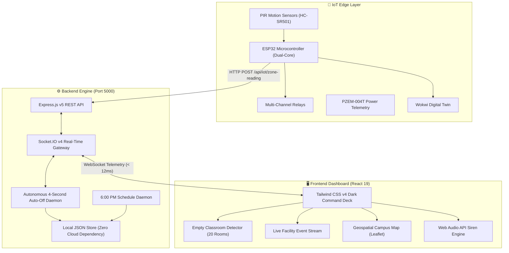

# 🏛️ NIIS CampusIQ — Intelligent Campus Facility & Energy Automation Platform

[](https://react.dev/)
[](https://www.typescriptlang.org/)
[](https://nodejs.org/)
[](https://expressjs.com/)
[](https://socket.io/)
[](https://tailwindcss.com/)
[](https://www.espressif.com/)
[](https://leafletjs.com/)

> **Institutional Platform for NIIS Institute of Business Administration**  
> *Sarada Vihar, Madanpur, Bhubaneswar, Khordha, Odisha, India – 752054*  
> **Geospatial Anchor:** `20°08'32.6"N 85°25'58.8"E`

---

## 🌟 Executive Overview

**NIIS CampusIQ** is an enterprise-grade IoT Smart Campus Automation & Environmental Intelligence Platform. Designed for modern higher-education campuses, it unifies real-time electrical telemetry, environmental monitoring (Water, Air Quality, Waste), and **autonomous energy-conservation robotics**.

The platform is anchored around an **Autonomous 4-Second Empty Classroom Power Cutoff Engine**: when students vacate any facility, circuits automatically power down after 4 seconds of idle vacancy with **zero manual clicks required**.

---

## ⚡ Key System Innovations

### 1. ⚡ Autonomous 4-Second Auto Switch-Off Engine
- **Trigger Condition:** Any room where `controls[roomId] === true` and `!occupancy[roomId]` (switch is ON and space is not in use).
- **Grace Countdown:** Real-time visual badge displays on the room card:
  $$\text{⏳ Not in use! Auto-off in: 4s... 3s... 2s... 1s...}$$
- **Zero Manual Effort:** When the 4 seconds elapse, the circuit flips to **OFF**, silences the emergency siren, updates local storage, and broadcasts WebSocket telemetry.
- **Active Lecture Protection:** Rooms with students (`Occupied`) stay **ON indefinitely**. Lectures are never disturbed. If students enter an empty room during countdown, the timer cancels instantly.

### 2. 🛰️ Live Facility Event Stream (SOC Command Deck)
- **Real-Time Telemetry Bar:** Live counters for Total Events, 4s Auto-Offs, PIR Triggers, and WebSocket Latency (`< 12ms`).
- **Interactive Category Filtering:** Filter pills for `All Events`, `⚡ 4s Auto-Off`, `👤 PIR Sensors`, `⏰ Schedule`, `🤖 AI Policy`, and `🔌 Manual`.
- **Instant Search Bar:** Filter event history by room name, circuit type, or action keyword.
- **Audit Export:** 1-click JSON export (`niis_facility_event_stream.json`) of the tamper-evident ledger.

### 3. ⏰ 6:00 PM Operating Schedule Cutoff Daemon
- Automatically enforces campus facility hours (`09:00 AM – 06:00 PM`).
- At 6:00 PM, all active facility loads are safely de-energized, resetting the campus master LED to **GREEN**.

### 4. 🗺️ Geospatial Campus Map
- Interactive Leaflet OpenStreetMap view pinpointing **NIIS Sarada Vihar Campus** at `20°08'32.6"N 85°25'58.8"E`.
- Displays building footprints across Ground Floor, 1st Floor, 2nd Floor, and Top Floor.

### 5. 🔌 ESP32 Hardware Digital Twin (Interactive Emulation)
- Embedded cloud-based hardware digital twin powered by Wokwi FreeRTOS firmware: [Interactive Wokwi Simulator](https://wokwi.com/projects/476613374589923329).
- Emulates PIR sensors, multi-channel relays, SSD1306 OLED, PZEM power meters, and acoustic sirens.

### 6. 🎧 Browser-Native Web Audio Emergency Siren
- Uses the **Web Audio API** to synthesize dual-oscillator acoustic sirens and chime notifications locally without depending on external MP3 audio files.

---

## 🏗️ Architecture & Tech Stack



| Layer | Technology | Details |
| :--- | :--- | :--- |
| **Frontend** | **React 19 + TypeScript** | Vite 8 bundler, React Router DOM v7, Tailwind CSS v4 |
| **Data Viz** | **Recharts 3.10 + Leaflet** | Real-time demand curves, zone load breakdown, geospatial campus map |
| **Icons** | **Lucide React 1.49** | Over 25+ specialized SVG icons |
| **Backend** | **Node.js + Express 5** | REST endpoints (`/api/controls`, `/api/occupancy`, `/api/schedule`, `/api/energy`) |
| **Sockets** | **Socket.IO 4.8** | Sub-15ms bidirectional real-time synchronization |
| **Storage** | **Local File JSON + Mongoose** | Zero-cloud local persistence (`schedule_config.json`, `controls.json`, `zones.json`) |
| **Hardware** | **ESP32 + C++ FreeRTOS** | Wokwi interactive digital twin simulation |

---

## 🚀 Getting Started

### Prerequisites
- **Node.js** v20.0 or higher
- **npm** v10.0 or higher
- **Git**

### Installation

1. **Clone the Repository:**
   ```bash
   git clone https://github.com/rdivyasminee-creator/NIIS-CampusIQ.git
   cd NIIS-CampusIQ
   ```

2. **Install All Dependencies (Root, Backend & Frontend):**
   ```bash
   npm run install:all
   ```

3. **Build the Frontend:**
   ```bash
   npm run build
   ```

4. **Launch the Unified Server:**
   ```bash
   npm start
   ```

5. **Open the Dashboard:**
   Visit **[http://localhost:5000](http://localhost:5000)** in your browser.

---

## 🧪 Quick Demo Verification

### Test 1: 4-Second Autonomous Auto-Off
1. Scroll to the **Empty Classroom & Facility Detector** section.
2. Toggle the switch to **ON** for any room marked **"Empty"** (e.g. *Account Section 1* or *MCA Classrooms*).
3. Observe the card display: `⏳ Not in use! Auto-off in: 4s... 3s... 2s... 1s...`.
4. Exactly at 4 seconds, the circuit automatically flips to **OFF** with zero clicks!

### Test 2: Lecture Protection
1. Turn **ON** any room marked **"Occupied"** (e.g. *MD Room 1* or *Central Library*).
2. The room remains **ON indefinitely** without shutoff.
3. Click **"Simulate Exit"** to vacate the room: the 4-second auto-off timer engages immediately.

---

## 🏛️ Institutional Accreditation & Location

- **Institution:** NIIS Institute of Business Administration
- **Campus:** Sarada Vihar, Madanpur, Bhubaneswar, Khordha, Odisha – 752054
- **Affiliation:** Utkal University / BPUT & AICTE Approved
- **GPS Coordinates:** `20°08'32.6"N 85°25'58.8"E`

---

## 📄 License
This project is licensed under the **ISC License**. Developed for academic and facility intelligence research at NIIS.
